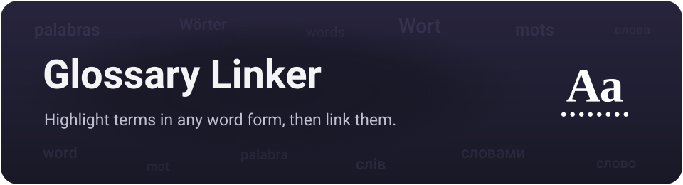
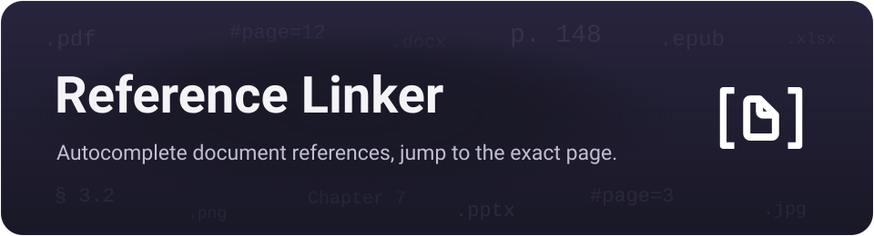

<p align="center">
  
</p>

# Heading Linker

Finds words in your notes and turns them into links to matching **headings** inside files you nominate as glossaries — in any word form (declensions, plurals), not just exact spellings. Keep a `Guide.md` with a `## Projectile` heading, and every "projectile", "projectiles" or other form elsewhere gets highlighted and can become `[[Guide#Projectile|projectiles]]`: a real link that opens the file at that heading, with the note's own wording kept as the visible text.

It's the file-based sibling of [Glossary Linker](https://community.obsidian.md/plugins/glossary-linker) — that one treats each note as a term, this one treats each heading inside a chosen file as a term, on the same matching engine.

> **Beta.** Not in the community catalog yet — install via [BRAT](#installation) for now.

The plugin ships as `main.js`, `manifest.json` and `styles.css`. Six language modules are baked into `main.js`, so morphology works the moment you install it. `main.js` is built from `src/` with esbuild (see [Development](#development)).

## Contents

- [What it does](#what-it-does)
  - [Highlight headings in any word form](#highlight-headings-in-any-word-form)
  - [Turn headings into real links](#turn-headings-into-real-links)
  - [Unlink](#unlink)
  - [Aliases](#aliases)
  - [Suggest links as you type](#suggest-links-as-you-type-optional)
  - [Ambiguous headings](#ambiguous-headings)
- [Sources and scope](#sources-and-scope)
- [Morphology and languages](#morphology-and-languages)
- [Commands](#commands-command-palette-ctrlp)
- [Settings](#settings)
- [Skipped contexts](#skipped-contexts)
- [Performance](#performance)
- [Licenses & credits](#licenses--credits)
- [Development](#development)
- [Installation](#installation)
- [Compatibility](#compatibility)
- [Related plugins](#related-plugins)

## What it does

### Highlight headings in any word form

Words that match a heading are underlined in Reading view and in the editor (Live Preview / Source). Matching follows word forms through a stemmer, so "spawns", "spawning" and "spawn" all find a `Spawn` heading, and Russian "рой", "роя", "рои" all find `Рой` — not just the exact spelling. Editor highlighting can run live, on save, or off.

Compared with virtual-link plugins such as Virtual Linker and FakeLink, the two differences are that Heading Linker matches inflected forms (they match literal text) and that it can turn matches into real links, not only show an overlay.

### Turn headings into real links

The highlight is a live overlay that changes nothing on disk — but you can *materialize* it: turn matches into actual `[[File#Heading|word]]` wikilinks, for the current note, a selection, or every note in scope. A preview lists every replacement first; nothing is written until you apply, and a note edited since the preview is skipped. Materialized links are ordinary wikilinks, so they get native hover-preview and click, and count in the graph and backlinks.

### Unlink

The reverse of materialize: replace heading links with their plain text again, for the current note, a selection, or all notes — also with a preview. Right-clicking a single heading link offers **Unlink this link**.

### Aliases

A heading can carry extra wordings — abbreviations or synonyms the stemmer won't reach — in an Obsidian comment right under it:

```markdown
## Central nervous system
%% alias: CNS, brain and spinal cord %%
```

Now "CNS" and "brain and spinal cord" link to that heading too, in any word form, and appear in the autocomplete. Comments are invisible in Reading view, so the note stays clean; use `alias:` or `aliases:`, comma-separated. Reading them is cheap — see [Performance](#performance) — and the **Heading aliases** setting turns it off entirely if you don't use them.

### Suggest links as you type (optional)

With **Suggest links while typing** on, typing a word that is (a form of) a heading or an alias offers to complete it into a link. Off by default.

### Ambiguous headings

The same heading text in two different files is two different terms. When a word could point at either, the highlight is marked as ambiguous and asks which one you meant — on click, and in the materialize preview (one choice per word, applied everywhere).

## Sources and scope

Two separate questions, two separate settings:

- **Sources** — where headings are collected from: the whole vault, or chosen files and folders. An **Ignored sources** list drops files or folders that should never contribute headings, even in whole-vault mode.
- **Scope** — where links are made: the whole vault, or chosen folders, with an **Always excluded** list. A single note can also opt out with a `heading-linker: false` frontmatter property.

Both lists are editable from the settings tab, the file explorer's right-click menu, and the command palette (acting on the active note).

## Morphology and languages

Matching reduces each word to a stem so different forms of the same word collapse together. Six languages are built in — English, Russian, Ukrainian, German, Spanish and French — and you choose which are active and in what priority order. On first run the plugin enables English plus your Obsidian interface language, if a module exists for it.

Enable only the languages your vault actually uses: since same-script languages combine, leaving German on in an English-only vault can occasionally over-stem a word. The **Match mode** setting also offers a lighter ending-strip or an exact (case-insensitive) mode instead of the full stemmer.

## Commands (command palette, Ctrl+P)

| Command | What it does |
| --- | --- |
| **Link headings: this note / selection / all notes** | Turn matches into links, with a preview. |
| **Unlink headings: this note / selection / all notes** | Revert heading links to plain text, with a preview. |
| **Rebuild heading index** | Re-scan the glossary files for headings and aliases. |

Plus per-note toggles that mirror the explorer menu, each shown only when it applies: **Add / Remove this note … heading sources**, **Ignore / Stop ignoring this note as a heading source**, **Never link in this note / Stop always-excluding**, **Include this note in scope / Remove from scope**.

## Settings

- **Sources** — collect headings from the whole vault or chosen files/folders; ignored sources; which heading levels (H1–H6) become terms; whether to read alias comments.
- **Scope** — link across the whole vault or chosen folders; always-excluded folders.
- **Matching** — match mode (stemmer / ending-strip / exact); minimum heading length; smart case for acronyms; active languages and their priority; link only the first occurrence per note; excluded headings.
- **Highlighting** — Reading-view highlight on/off; editor highlight live / on save / off; skip a note's own headings; status-bar count (optionally counting existing links).
- **Autocomplete** — suggest links while typing; minimum typed length; characters after which to stay silent.
- **Context menu** — toggle each group of right-click items (link, open, exclude, unlink).
- **Maintenance** — rebuild the index on demand.

The highlight color and underline styles are exposed through **[Style Settings](https://github.com/mgmeyers/obsidian-style-settings)** if you have it.

## Skipped contexts

Words are never linked (and suggestions never fire) inside code blocks (` ``` ` and `~~~`), inline code, frontmatter, `%%` comments, existing `[[...]]` and `[..](..)` links, or URLs; a note's own headings are skipped too unless you turn that off. When a link is written into a Markdown table cell, the alias pipe is escaped so the row isn't broken. Headings that contain `|`, `#`, `[`, `]` or `^` are not indexed, because those characters can't sit inside a `[[File#Heading]]` target.

## Performance

Rebuilding the index never reads file bodies — it works from Obsidian's metadata cache. Alias comments are the one thing that needs the body; they are read once per file, cached, and re-read only when that file changes, so a rebuild triggered by a settings change costs nothing extra. In whole-vault sourcing you can turn alias reading off completely. The per-keystroke check that suppresses suggestions in code, links and comments tests only the cursor position, not the whole document.

## Licenses & credits

Most bundled language modules port well-known, permissively-licensed stemming algorithms (`uk.js` is the plugin's own, under its MIT license). All are free for commercial and non-commercial use; the only obligation is keeping the attribution notices, which are already in each file's header.

| Module | Algorithm | License | Reference |
|---|---|---|---|
| `ru.js` | Snowball Russian stemmer (Porter framework) | BSD (© 2001–2006 M. Porter & R. Boulton) | [snowballstem.org](https://snowballstem.org/algorithms/russian/stemmer.html) · [license](https://snowballstem.org/license.html) |
| `uk.js` | Light suffix stemmer with vowel alternation | MIT (this plugin) | — |
| `en.js` | Porter stemmer (M. F. Porter, 1980) | Free use, released by the author | [tartarus.org](https://tartarus.org/martin/PorterStemmer/) |
| `es.js` | Apache Lucene `SpanishLightStemmer` (UniNE, J. Savoy) | Apache License 2.0 | [source](https://github.com/apache/lucene/blob/main/lucene/analysis/common/src/java/org/apache/lucene/analysis/es/SpanishLightStemmer.java) |
| `de.js` | Apache Lucene `GermanLightStemmer` (UniNE, J. Savoy) | Apache License 2.0 | [source](https://github.com/apache/lucene/blob/main/lucene/analysis/common/src/java/org/apache/lucene/analysis/de/GermanLightStemmer.java) |
| `fr.js` | Apache Lucene `FrenchLightStemmer` (UniNE, J. Savoy) | Apache License 2.0 | [source](https://github.com/apache/lucene/blob/main/lucene/analysis/common/src/java/org/apache/lucene/analysis/fr/FrenchLightStemmer.java) |

The es/de/fr stemmers were translated to JavaScript and adapted to this plugin's module interface; per the Apache License the source files note that they are modified ports. Apache 2.0 full text: <https://www.apache.org/licenses/LICENSE-2.0>. Heading Linker itself is released under the MIT license — see [`LICENSE`](LICENSE).

## Development

The core is written as small CommonJS modules in `src/` and bundled into `main.js` by esbuild. The language modules live in the shared submodule, under `src/shared/morphology/languages/`, and are bundled in through `src/shared/morphology/builtin-languages.js`; adding a language means contributing a module there and rebuilding (see [`languages/README.md`](src/shared/morphology/languages/README.md)). Nothing is loaded or executed at runtime.

Generic code shared with the sibling linker plugins lives in `src/shared/`, a git submodule of [obsidian-linker-shared](https://github.com/max-fluff/obsidian-linker-shared). Clone with `--recurse-submodules` so the build can find it:

```sh
git clone --recurse-submodules https://github.com/max-fluff/obsidian-heading-linker
npm install      # once, installs esbuild
npm run build    # bundle src/ -> main.js
```

In an existing clone without the submodule, run `git submodule update --init` first.

`src/` layout:

- `main.js` — the `Plugin` class: lifecycle, commands, menus, scope and sources, link writing, alias parsing, small helpers; applies the mixins below.
- `constants.js` — default settings.
- `matcher.js` — the heading index and matching engine (`keysFor`, `tokenizeForm`, `rebuildIndex`, `findMatches`, protected ranges).
- `highlight.js` — Reading-view DOM highlighting and the CM6 editor extension.
- `materialize.js` — turning matches into links and reverting them, plus the link context menu.
- `modals.js` — the materialize/unlink preview dialogs and the choose-heading dialog.
- `settings-tab.js` — the settings UI.
- `folder-suggest.js` — path autocomplete for the source/scope lists (feature-detected).
- `heading-suggest.js` — the editor autocomplete (`EditorSuggest`, feature-detected).
- `shared/` — git submodule shared with the sibling plugins: markdown helpers, the i18n engine, the folder-list settings editor, and `morphology/` (the language modules, their contract and `validateLanguage()`).
- `locales/` — interface strings (English and Russian), fed to the shared i18n engine.

`main.js` is generated; edit `src/` and rebuild rather than editing it directly. `node_modules/`, `package-lock.json` and `esbuild.local.mjs` are git-ignored.

## Installation

**Beta builds via [BRAT](https://github.com/TfTHacker/obsidian42-brat) (for now).** Install the BRAT community plugin, add the repository `max-fluff/obsidian-heading-linker`, then enable **Heading Linker** in *Settings → Community plugins*.

**Manually.** Download `main.js`, `manifest.json` and `styles.css` from the [latest release](https://github.com/max-fluff/obsidian-heading-linker/releases/latest) into `<vault>/.obsidian/plugins/heading-linker/`, then enable the plugin in *Settings → Community plugins*.

Once installed, set your glossary files (or switch to whole-vault sourcing) under *Settings → Heading Linker → Heading sources*. A community-catalog listing is planned.

## Compatibility

Requires Obsidian 1.4.0 or newer, and works on both desktop and mobile — it reads headings from Obsidian's metadata cache, not the filesystem. Interface in English and Russian, following Obsidian's language.

Nothing below is required, but the plugin cooperates with them if you have them:

- **[Style Settings](https://github.com/mgmeyers/obsidian-style-settings)** — a UI for the highlight color and underline styles, including the ambiguous-heading underline.
- **Page Preview** (core plugin) — provides the hover preview on heading links; the plugin registers as its own *Heading Linker* source you can toggle independently.

## Related plugins

Also by the author — the rest of the linker family. Two of them highlight words already in your notes and link them; two autocomplete a name into a deep-link that lands on the exact spot.

**[Glossary Linker](https://community.obsidian.md/plugins/glossary-linker)** — highlights glossary terms in any word form, turns them into real links, and learns new aliases from links you've already made. This plugin is its file-based counterpart: a heading as a term instead of a whole note. Works on desktop and mobile.

<p align="center">
  <a href="https://community.obsidian.md/plugins/glossary-linker">
    
  </a>
</p>

**[Code Linker](https://community.obsidian.md/plugins/code-linker)** — autocompletes references to your source code and inserts a deep-link that opens the file at the exact line in your editor (VS Code, JetBrains, …). Desktop-only.

<p align="center">
  <a href="https://community.obsidian.md/plugins/code-linker">
    
  </a>
</p>

**[Reference Linker](https://github.com/max-fluff/obsidian-reference-linker)** — autocompletes links to external documents (PDF, Office, images) and inserts a deep-link that opens them at the right page in an external viewer. Desktop-only. Not in the community catalog yet.

<p align="center">
  <a href="https://github.com/max-fluff/obsidian-reference-linker">
    
  </a>
</p>
